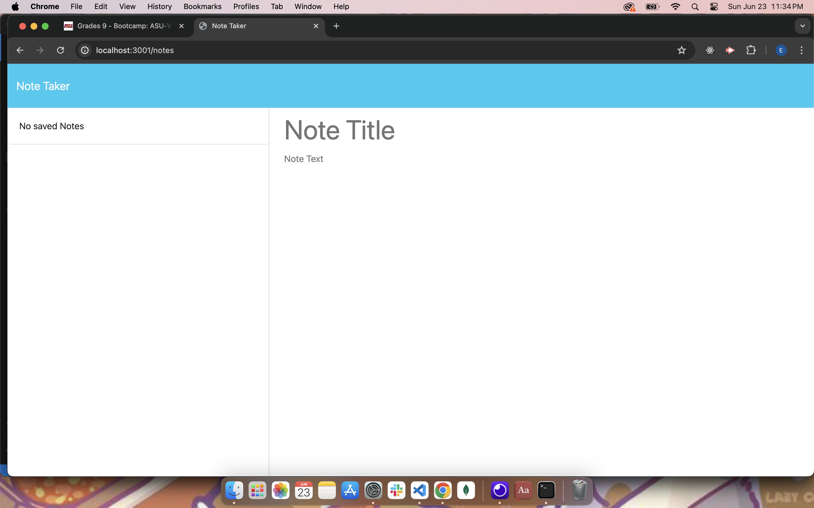

# Note Taker

## Description
Front end web application that allows you to create and delete notes.

## Table of Contents
- [Description](#description)
- [Installation](#installation)
- [Usage](#usage)
- [License](#license)
- [Contributing](#contributing)
- [Tests](#tests)
- [Questions](#questions)

## Installation
Run commands npm i && node server.js

## Usage
Use the create note button to start creating a new note. When you no longer need the note just hit the delete button.

## License
undefined

## Contributing
Ezra J Rogers

## Tests
No test instructions

## Questions
For additional questions, contact [undefined](https://github.com/undefined) or email [undefined](mailto:undefined).
